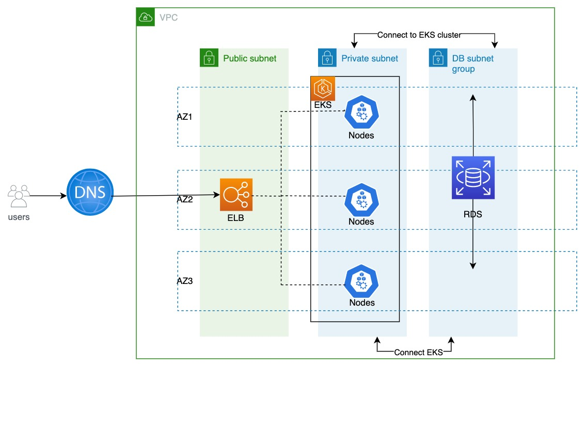
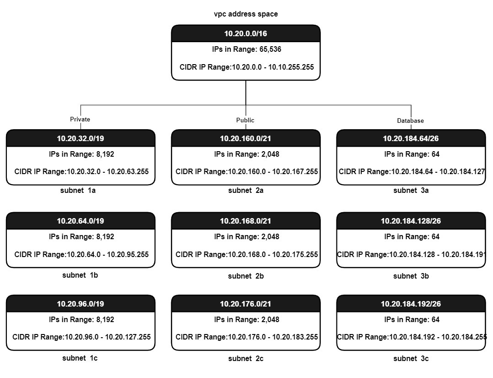

# AWS microservices Infrastructure using Terraform

This README describes the infrastructure that has been set up using Terraform. The infrastructure consists of a VPC, an EKS cluster, and an RDS database. The VPC has three subnets: a public subnet, a private subnet, and a database subnet. The public subnet is used to host the load balancer, which will be exposed to the internet. The private subnet is used to host the application workload. The database subnet is used to host the RDS database.

The EKS cluster is deployed in the private subnet. It is a scalable and fault-tolerant cluster that can be used to run microservices-based applications. The RDS database is also deployed in the private subnet. It is a managed database service that is highly available and scalable.

 

Let's get a better understanding of our infrastructure components:

1. **Virtual Private Cloud (VPC)**: Our VPC is based on a CIDR block of 10.20.0.0/16, providing a generous pool of IP addresses. It's partitioned into public, private, and database subnets, each spanning across three different availability zones for high availability. The public subnet is associated with a Load Balancer handling external traffic, the private subnet caters to application workloads, and the isolated database subnet serves our managed database service.



1. **Amazon Elastic Kubernetes Service (EKS)**: We employ a secure, scalable, and resilient EKS cluster, based on the latest 1.27 version. This Kubernetes management platform has no direct internet exposure, ensuring an added layer of security. It features user access segregation and adopts robust security mechanisms like OpenID Connect (OIDC), IAM Roles for Service Accounts (IRSA), Security Groups, and Network Access Control Lists (NACLs). 

    **OIDC** allows apps to verify users' identity based on the authentication performed by an authorization server, enabling a federation to AWS IAM and allowing us to assign fine-grained access permissions to AWS services directly from Kubernetes. 

    **IRSA** associates IAM roles with a Kubernetes service account, providing fine-grained permission management for applications running on EKS without needing to share the same permissions as the worker node's IAM role. The combined usage of OIDC and IRSA guarantees a tightly secure environment for our EKS cluster.

2. **Amazon Relational Database Service (RDS)**: We use a managed RDS (MySQL 8) for its scalability and high availability. It's configured to monitor audit, slow-query, and error logs, all directed to an AWS CloudWatch log group for effective tracking. The RDS password is autogenerated and securely stored in the AWS Secret Manager, thus reducing the potential risk of unauthorized access.

## Scalability and Fault Tolerance 

Our Kubernetes cluster incorporates auto-scaling capabilities to ensure scalability. It's configured to scale dynamically based on traffic and server load, effectively handling peak and off-peak demands without compromising performance.

We've achieved fault tolerance through AWS's multi-availability zone features. All our subnets and databases are distributed across several availability zones. This means in the event of an individual zone failure, the application continues to operate seamlessly, with traffic automatically redirected to the next available zone, thereby minimizing potential service disruptions.

## Terraform Deployment

We utilize Terraform, a powerful infrastructure-as-code (IaC) tool, to deploy this project. The Terraform code provisions all necessary resources on AWS, ensuring seamless integration and operation. We've adhered to best practices by using official, reusable Terraform modules, making the code both maintainable and easy to modify.

The Terraform code that was used to provision the infrastructure is available in 3 directories:
- aws_vpc
- aws_eks
- aws_rds

## Prerequisites

To use this infrastructure, you will need the following:

An AWS account
The Terraform CLI
The AWS CLI

## Kick-starting Your Deployment

To deploy this infrastructure, you'll need to have Terraform installed on your machine. If you haven't done so yet, refer to the official [Terraform Documentation](https://learn.hashicorp.com/tutorials/terraform/install-cli) for installation instructions.

Once installed, clone this repository to your local machine and navigate to the project directory. Here are the commands to initialize and apply the Terraform configuration:

```bash
# Initialize Terraform
terraform init

# Plan the deployment
terraform plan

# Apply the configuration
terraform apply
```

**Note:** Make sure your AWS credentials are configured on your local system. For instructions, you can follow this [guide](https://docs.aws.amazon.com/cli/latest/userguide/cli-configure-files.html).

## The Journey Towards Continuous Improvement

While our current setup already provides a robust, scalable, and secure infrastructure, we are always looking for ways to enhance and automate our processes even further. One such improvement could be the integration of GitHub Actions and GitOps pipeline to automate infrastructure deployment and application rollout.

### Infrastructure Deployment with GitHub Actions

GitHub Actions, a CI/CD tool natively integrated with GitHub, can automate our Terraform workflows. Whenever code is pushed or a pull request is made to the main branch, GitHub Actions can be triggered to run a pipeline that tests, plans, and applies our Terraform configurations. This approach ensures that our infrastructure is automatically updated in a consistent and trackable manner, reducing manual error and enhancing efficiency.

### Application Deployment with GitOps Pipeline

For application deployment, we can leverage a GitOps approach using ArgoCD integrated with GitHub Actions. When a new application version is pushed to the repository, GitHub Actions will be triggered to build a new Docker image and push it to Amazon Elastic Container Registry (ECR).

The creation of a new image in ECR can then trigger an ArgoCD workflow that automatically syncs the new image with the existing Kubernetes manifests or Helm charts in the EKS cluster. This results in a smooth, automatic rollout of the updated application to the cluster.

By combining these techniques, we can achieve a fully automated, end-to-end delivery pipeline for our infrastructure and application. This not only improves our deployment speed and efficiency but also ensures that our infrastructure and application are always in a consistent and desired state.

These improvements certainly require a good deal of planning, configuration, and testing. But, the payoff of having a fully automated infrastructure and application pipeline is definitely worth the effort. It makes the development process more agile, efficient, and error-free, which directly translates to faster delivery, improved product quality, and increased customer satisfaction.
